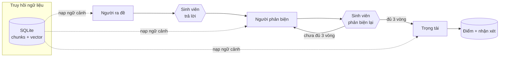

# Hệ thống AI giả lập người phản biện

Công cụ luyện tư duy phản biện cho sinh viên: hệ thống ra đề từ ngữ liệu ôn tập,
sinh viên trả lời, AI phản biện — sinh viên phản biện lại — lặp **3 vòng**, cuối cùng
một **trọng tài AI** độc lập chấm điểm và chỉ ra chỗ hổng kiến thức.

## Ngăn xếp công nghệ

| Thành phần | Lựa chọn |
| --- | --- |
| Ngôn ngữ | Python 3.10+ (đã kiểm thử trên 3.13) |
| Giao diện | Streamlit |
| Lưu trữ | SQLite (tài khoản, phiên, lịch sử, ngân hàng đề, ngữ liệu, vector) |
| LLM | OpenAI `gpt-4o-mini` (bản rẻ, cấu hình được) |
| RAG | Embedding `text-embedding-3-small` + tìm kiếm cosine bằng NumPy |
| Đa tác tử | Lớp `core/agents.py` + bộ chạy CrewAI tuỳ chọn |
| Đọc .docx | `zipfile` + `xml.etree` của thư viện chuẩn |
| Đọc .pdf | `pypdf` (chế độ `layout`) |

Không dùng vector database ngoài: vector lưu thẳng trong SQLite dưới dạng BLOB
`float32` đã chuẩn hoá, tìm kiếm bằng một phép nhân ma trận NumPy. Với quy mô ngữ
liệu vài nghìn đoạn, cách này nhanh và bớt được một hạ tầng phải vận hành.

## Nguồn dữ liệu

| Nguồn | Vai trò |
| --- | --- |
| `input/*.docx` | **Ngân hàng câu hỏi** của giảng viên, đã phân sẵn theo chương và nhóm độ khó. Hệ thống bốc ngẫu nhiên câu hỏi từ đây. |
| `input/*.pdf` | **Giáo trình**, bóc theo chương thành ngữ liệu cho RAG. |
| `input/mapping.json` | Khai báo giáo trình nào thuộc môn nào, khi tên file không đủ để đoán. |
| `data/corpus/**/*.md` | Ngữ liệu demo viết tay. **Mặc định tắt**, bật bằng `INCLUDE_DEMO_CORPUS=true`. |

Các nguồn độc lập nhau và ghép với nhau theo *môn + số chương*: ngân hàng câu hỏi lo
phần **hỏi gì**, giáo trình lo phần **căn cứ để phản biện và chấm**.

Dữ liệu đang nạp (3 môn, 24 chương, 150 câu hỏi, 1.774 đoạn ngữ liệu):

| Môn | Chương | Câu hỏi | Đoạn ngữ liệu |
| --- | --- | --- | --- |
| Pháp luật đại cương | 9 | 62 | 635 |
| Thương mại điện tử căn bản | 10 | 41 | 878 |
| Ứng dụng công nghệ thông tin căn bản | 5 | 47 (trắc nghiệm) | 261 |

Từ đó sinh ra **hai chế độ nền kiến thức**, hệ thống tự chọn và hiển thị rõ cho người học:

- **`corpus`** — chương có ngữ liệu: AI phản biện bám sát đoạn được truy hồi, được yêu
  cầu nói "ngữ liệu chưa đề cập" thay vì suy diễn.
- **`bank`** — chương chỉ có ngân hàng đề: không có gì để truy hồi, AI dùng kiến thức
  chuyên môn của mô hình trong phạm vi chủ đề của chương, và bị **cấm bịa số hiệu điều
  luật, tên văn bản, năm ban hành hay số liệu** — thay vào đó phải nhắc sinh viên đối
  chiếu văn bản gốc. Đây là hàng rào quan trọng với các môn luật.

## Kiến trúc đa tác tử

Nghiệp vụ được mô tả bằng **bốn tác tử vai trò tách bạch**, khai báo tường minh trong
[core/agents.py](core/agents.py). Mỗi tác tử có mục tiêu, bối cảnh, tham số sinh văn bản
và model riêng.

| Tác tử | Vai trò | Mục tiêu | Gọi khi |
| --- | --- | --- | --- |
| Người ra đề | Giảng viên ra đề ôn tập | Soạn câu hỏi đúng chương, đúng mức độ | Ngân hàng đề không có câu ở mức đã chọn |
| Người phản biện | Người phản biện học thuật | Tìm lỗ hổng lập luận và chất vấn đúng chỗ yếu | Mỗi vòng, 3 lần/phiên |
| Trọng tài | Giám khảo độc lập | Chấm 4 tiêu chí, chỉ chỗ hổng, gợi ý cải thiện | Cuối phiên, 1 lần |
| Người đặt nhãn chương | Trợ lý biên mục | Gọi tên chủ đề chương từ tập câu hỏi | Một lần lúc nạp học liệu |



Điều phối là vòng lặp Python thuần, trạng thái nằm ở SQLite (bảng `turns`) chứ không
trong bộ nhớ tác tử — mỗi lượt gọi là stateless, nhận lại toàn bộ diễn biến dựng từ CSDL.
Trọng tài cố ý tách biệt: prompt riêng, không biết chỉ dẫn của người phản biện, chỉ thấy
biên bản tranh biện và ngữ liệu chuẩn.

### Hai bộ chạy

Đổi bằng `AGENT_FRAMEWORK` trong `.env`, **không phải sửa mã nghiệp vụ**:

| | `native` (mặc định) | `crewai` |
| --- | --- | --- |
| Cách chạy | Gọi thẳng OpenAI qua `core/llm.py` | Dựng `Agent` + `Task` + `Crew` mỗi lượt |
| Phụ thuộc | Không thêm gì | Thêm ~94 gói (~1.5–2 GB) |
| Số lời gọi LLM | 5 mỗi phiên | 5 mỗi phiên (mỗi Crew đúng một Task, `max_iter=1`) |
| Dùng khi | Chạy thật, máy chủ cấu hình thấp | Trình bày kiến trúc, mở rộng sang tool/delegation |

```bash
pip install -r requirements-crewai.txt   # chỉ khi cần
# .env:  AGENT_FRAMEWORK=crewai
```

Bộ chạy CrewAI nằm trong [core/crew_backend.py](core/crew_backend.py), chỉ được nhập khi
thật sự bật — bản cài mặc định không cần thư viện này.

### Hướng mở

- **Model riêng cho từng vai**: đặt `JUDGE_MODEL=gpt-4o` để trọng tài mạnh hơn người
  phản biện, giảm thiên vị khi chấm (hiện cả hai dùng chung `gpt-4o-mini` nên thiên lệch
  của model là tương quan — tách prompt chỉ giảm chứ không triệt tiêu).
- **Thêm tác tử mới**: khai một `AgentSpec` rồi gọi `agents.run(...)`. Ví dụ có thể thêm
  *Người kiểm chứng dữ kiện* (đối chiếu phát biểu của sinh viên với ngữ liệu) hay
  *Huấn luyện viên* (gợi ý cách lập luận sau mỗi vòng).
- **Đổi kiểu điều phối**: với CrewAI có thể chuyển `Process.sequential` sang
  `Process.hierarchical` để một tác tử quản lý điều phối các tác tử còn lại.

## Cài đặt

```bash
pip install -r requirements.txt
copy .env.example .env        # Windows;  Linux/macOS: cp .env.example .env
```

Mở `.env` và điền `OPENAI_API_KEY`. Sau đó:

```bash
streamlit run app.py          # hoặc nhấn đúp run.bat trên Windows
```

Lần chạy đầu tiên hệ thống tự tạo `data/app.db`, bóc ngân hàng câu hỏi (`.docx`) và giáo
trình (`.pdf`) trong `input/`, rồi sinh embedding. Với bộ dữ liệu hiện tại mất khoảng
5 phút (phần lớn là đọc 3 file PDF ~700 trang) và vài nghìn đồng tiền embedding.

> **Chế độ ngoại tuyến:** nếu để trống `OPENAI_API_KEY`, ứng dụng vẫn chạy đủ luồng
> nghiệp vụ nhưng phần phản biện dùng nội dung mẫu dựng sẵn và RAG chuyển sang tìm
> kiếm từ vựng (TF-IDF). Chế độ này chỉ để demo/kiểm thử, không dùng để học thật.

## Luồng nghiệp vụ

1. **Đăng ký** — tên sinh viên, email, mật khẩu. Email không được trùng; tài khoản
   kích hoạt ngay, không cần xác nhận. Mật khẩu băm PBKDF2-HMAC-SHA256, 200.000 vòng,
   salt riêng cho từng người.
2. **Đăng nhập** — bằng email + mật khẩu. Mọi chức năng đều yêu cầu đăng nhập.
   Phiên được giữ qua lần tải lại trang: khi đăng nhập, hệ thống sinh một token ngẫu
   nhiên lưu ở bảng `auth_tokens` và gắn vào URL (`?sid=...`). Token tự gia hạn mỗi lần
   dùng, hết hạn sau `SESSION_TTL_DAYS` ngày (mặc định 7) và bị thu hồi khi đăng xuất.
3. **Chọn** môn học → chương → mức độ (dễ / trung bình / khó). Màn hình hiển thị sẵn
   chương đó có bao nhiêu câu hỏi ở mỗi mức và có tài liệu tham khảo hay không.
4. **Ra đề** theo thứ tự ưu tiên:
   - Bốc ngẫu nhiên trong **ngân hàng câu hỏi** đúng chương + đúng mức độ, ưu tiên câu
     mà người học chưa gặp gần đây.
   - Nếu mức độ đó chưa có câu nào trong tài liệu (ví dụ tài liệu chỉ có nhóm *dễ* và
     *trung bình*), LLM sinh một câu mới trong phạm vi chương.
5. **Tranh biện 3 vòng** — mỗi lượt của AI đều truy hồi lại ngữ liệu theo câu trả lời
   mới nhất, và tăng dần độ gắt: vòng 1 soi lỗ hổng lớn, vòng 2 kiểm tra phần phản biện
   có thật sự trả lời chất vấn không, vòng 3 đưa tình huống biên khó nhất.
6. **Trọng tài** — một lời gọi LLM riêng, prompt độc lập, chấm 4 tiêu chí (độ chính xác,
   độ đầy đủ, chất lượng lập luận, phản hồi phản biện), kết luận bên nào thuyết phục hơn,
   liệt kê điểm mạnh/yếu, kiến thức cần ôn lại, đáp án tham khảo và gợi ý cải thiện.
7. **Lịch sử cá nhân** — xem lại toàn bộ diễn biến từng phiên, điểm số, thống kê theo môn.
8. **Tài liệu nguồn** — trang theo dõi mọi file trong `input/`: trạng thái *đã nạp / file
   mới / đã sửa / đã xoá*, nạp được những gì, và nút quét lại. **Chỉ quản trị viên** mở
   được (mặc định `admin@gmail.com`, đổi bằng `ADMIN_EMAILS` trong `.env`); tài khoản
   khác không thấy nút và cũng không vào thẳng được.

Với **câu trắc nghiệm**, giao diện hiện ô chọn đáp án A–D kèm ô nhập giải thích: sinh
viên phải chọn một phương án *và* biện minh mới gửi được. Ở các vòng sau vẫn đổi đáp án
được — lượt trả lời ghi rõ đã đổi từ phương án nào. AI được dặn không nói thẳng đáp án
đúng, chỉ vạch chỗ hổng trong lý do để sinh viên tự xét lại các phương án còn lại.

## Cấu trúc mã nguồn

```text
app.py                  Giao diện Streamlit (đăng nhập, luyện tập, lịch sử)
bootstrap_data.py       Nạp dữ liệu + xây chỉ mục vector từ dòng lệnh
smoke_test.py           Kiểm thử toàn bộ nghiệp vụ, không cần giao diện
ui_test.py              Kiểm thử giao diện bằng streamlit.testing
crew_test.py            Kiểm thử bộ chạy CrewAI (chạy bằng .venv-crewai)
requirements-crewai.txt Phụ thuộc bổ sung, chỉ cần khi AGENT_FRAMEWORK=crewai
deploy/                 systemd + nginx + hướng dẫn triển khai Ubuntu
core/
  config.py             Cấu hình, đặc tả mức độ khó
  db.py                 Lược đồ + kết nối SQLite
  auth.py               Đăng ký / đăng nhập / băm mật khẩu
  llm.py                Bọc OpenAI (chat, chat JSON, embedding)
  agents.py             Khai báo 4 tác tử + điều phối, chọn backend
  crew_backend.py       Bộ chạy tác tử bằng CrewAI (chỉ nhập khi bật)
  rag.py                Cắt đoạn, embedding, tìm kiếm vector + dự phòng từ vựng
  docx_parser.py        Bóc ngân hàng câu hỏi từ .docx (chương / nhóm độ khó)
  pdf_parser.py         Bóc giáo trình .pdf theo chương thành ngữ liệu RAG
  ingest.py             Nạp cả ba nguồn dữ liệu (idempotent theo SHA)
  debate.py             Ra đề, phản biện từng vòng, trọng tài
  repository.py         Truy vấn môn/chương/ngân hàng đề/phiên/lịch sử
input/                  Tài liệu thô của giảng viên (.docx, .pdf) — nạp tự động
data/corpus/            Ngữ liệu ôn tập (markdown) + manifest.json
```

## Lược đồ CSDL

`users` · `auth_tokens` · `subjects` · `chapters` · `questions` · `documents` ·
`chunks` · `embeddings` · `ingest_files` · `sessions` · `turns` · `verdicts`

`ingest_files` là bảng ghi vết tài liệu: đường dẫn, mã băm nội dung, loại file, tóm tắt
kết quả nạp và mốc thời gian.

Một phiên (`sessions`) có 7 lượt (`turns`): 1 câu trả lời gốc + 3 lượt AI phản biện +
3 lượt sinh viên phản biện, và 1 bản án (`verdicts`) lưu JSON đầy đủ của trọng tài.

## Thêm dữ liệu mới

Mọi tài liệu trong `input/` đều được **ghi vết theo mã băm nội dung** trong bảng
`ingest_files`. Nhờ đó hệ thống tự phân biệt file mới, file đã sửa, file không đổi và
file đã bị xoá — chỉ xử lý phần thay đổi, và dọn dữ liệu của file không còn tồn tại.
Xem trạng thái ở trang **📁 Tài liệu nguồn** hoặc bằng `python bootstrap_data.py --status`.

**Thêm ngân hàng câu hỏi (.docx):** thả file vào `input/` rồi bấm *Quét lại* (hoặc chạy
`bootstrap_data.py`). Bộ phân tích nhận dạng theo các mốc:

- học phần: `N. Học phần N: <tên môn>` — **một file có thể chứa nhiều học phần**, mỗi
  học phần thành một môn riêng
- mục lục: các dòng `Chương N: <tiêu đề>`
- phần câu hỏi: `x.y. CÂU HỎI ... CHƯƠNG N` → `x.y.z. Nhóm câu hỏi dễ|trung bình|khó:`
- câu hỏi: `Câu hỏi N.`, `Câu N:`, `Câu N ;` — hoặc **không đánh số**, khi đó mỗi đoạn
  văn là một câu
- câu trắc nghiệm: các dòng `A.` `B.` `C.` `D.` được giữ nguyên, gắn vào câu ngay trước

Bộ phân tích được viết để chịu được dữ liệu thật: đọc bằng XML thay vì regex (nhiều file
có đoạn lồng nhau làm cách cắt bằng biểu thức chính quy lấy nhầm cả thẻ XML), câu hỏi bị
dồn chung một đoạn, tiêu đề chương dính liền câu trước, lỗi OCR (`CẦU HỎI`, `CÂU HỒI`,
`HƯỚNG DĂN`, `CHương`), số trang và ký tự rác lẫn vào. Câu hỏi trùng nhau giữa các file
được tự khử.

Chương nào có tiêu đề chung chung (kiểu "Pháp luật 1") mà không có giáo trình kèm theo
sẽ được LLM đặt nhãn chủ đề **một lần duy nhất** rồi lưu vào CSDL.

**Thêm giáo trình (.pdf):** thả file vào `input/` rồi khởi động lại. Bộ đọc dùng
`extraction_mode="layout"` của pypdf — chế độ mặc định chèn khoảng trắng vào giữa từ với
văn bản canh đều tiếng Việt ("quan h ệ pháp lu ật"), còn chế độ layout giữ nguyên chữ và
cả thụt đầu dòng nên nhận được ranh giới đoạn văn. Nhận dạng theo bố cục giáo trình
thông thường:

- bắt đầu chương: dòng `CHƯƠNG N` (hoa hay thường đều được) đứng một mình, hoặc kèm tiêu
  đề in hoa. Câu văn xuôi mở đầu chương ("Chương 1 đề cập đến…") bị loại.
- phân biệt mục lục với nội dung thật bằng **khối lượng chữ đi sau mỗi mốc**: dòng mục
  lục chỉ cách mốc kế tiếp vài trăm ký tự, chỗ chương thật bắt đầu thì kéo dài hàng chục
  nghìn. Nhờ vậy xử lý được cả sách để mục lục ở đầu lẫn ở cuối.
- kết thúc chương: mục `CÂU HỎI ... ÔN TẬP` hoặc `TÀI LIỆU THAM KHẢO`
- đề mục con `1.2.3.` → chuyển thành tiêu đề markdown để cắt đoạn theo đúng ngữ cảnh
- giải mã glyph `/uni1ED5` → `ổ`: một số PDF xuất chữ có dấu thành tên glyph thay vì ký
  tự thật (quyển Thương mại điện tử có 74.143 mã như vậy)
- bỏ qua: phần đầu sách, `MỤC LỤC`, chú thích chân trang, watermark, số trang

Giáo trình được ghép vào môn đã có khi **toàn bộ từ trong tên môn xuất hiện trong tên
giáo trình** (khớp theo tập từ, không so chuỗi con — nếu không, mã môn `AI` sẽ lọt vào
`PHAP_LUAT_DAI_CUONG`). Khi tên không khớp thì khai trong `input/mapping.json`:

```json
{
  "files": {
    "Giao trinh Tin hoc quan ly_Dai hoc Thuong mai.pdf": "Ứng dụng công nghệ thông tin căn bản"
  }
}
```

Giáo trình là nguồn chuẩn cho phần mô tả nội dung chương; riêng tiêu đề chương thì chỉ
ghi đè khi tiêu đề hiện có vô nghĩa (`Chương 3`, `Pháp luật 4`).

**Thêm ngữ liệu giải thích (.md):** tạo file trong `data/corpus/<mã_môn>/`, dùng tiêu đề
`##` để chia mục, khai báo trong `data/corpus/manifest.json`, đặt `INCLUDE_DEMO_CORPUS=true`
trong `.env`, rồi khởi động lại.

Bổ sung giáo trình cho một chương sẽ tự động nâng chương đó từ chế độ `bank` lên `corpus`.

Trên máy chủ không có giao diện, dùng lệnh tương đương:

```bash
python bootstrap_data.py             # chỉ xử lý file mới hoặc đã sửa
python bootstrap_data.py --force     # nạp lại tất cả, kể cả file không đổi
python bootstrap_data.py --reset     # xoá sạch học liệu cũ rồi nạp lại từ đầu
python bootstrap_data.py --status    # chỉ xem trạng thái tài liệu, không nạp
```

`--reset` xoá toàn bộ môn học, chương, câu hỏi, ngữ liệu và vector (kéo theo các phiên
tranh biện cũ) nhưng **giữ nguyên tài khoản người dùng**.

## Triển khai

Xem [deploy/DEPLOY.md](deploy/DEPLOY.md) — hướng dẫn đầy đủ cho Ubuntu Server với tài
khoản `ubuntu`.

Cách chính: **chạy thẳng Streamlit theo IP**, không cần nginx. Ứng dụng chạy nền bằng
systemd ([debate.service](deploy/debate.service)), truy cập tại `http://<IP>:8501`.
Hướng dẫn nêu cả hai tầng tường lửa phải mở (ufw + tường lửa nhà cung cấp), cách bỏ
`:8501` khỏi địa chỉ, bật HTTPS bằng SSL sẵn có của Streamlit, sao lưu và xử lý sự cố.

Phụ lục cuối tài liệu hướng dẫn đặt nginx phía trước, cần khi có tên miền và muốn chứng
chỉ Let's Encrypt.

## Kiểm thử

```bash
python smoke_test.py    # 50 kiểm thử nghiệp vụ (tác tử, nạp liệu, ghi vết file, RAG, trọng tài)
python ui_test.py       # 39 kiểm thử giao diện (giữ phiên, chọn đáp án, phân quyền admin)

# Chỉ khi bật CrewAI, chạy bằng môi trường đã cài thêm:
.venv-crewai/Scripts/python.exe crew_test.py     # 6 kiểm thử bộ chạy CrewAI
```

Cả hai chạy được ở chế độ ngoại tuyến. Khi đã cấu hình `OPENAI_API_KEY`, chúng gọi
model thật (chi phí không đáng kể với `gpt-4o-mini`) và in ra ví dụ phản biện thực tế.

## Chi phí vận hành

Mỗi phiên tranh biện tốn khoảng 5 lời gọi (1 ra đề + 3 phản biện + 1 trọng tài), mỗi
lời gọi kèm ngữ cảnh RAG vài nghìn token. Với `gpt-4o-mini`, chi phí một phiên ở mức
vài trăm đồng. Embedding chỉ tính một lần cho mỗi lần nội dung ngữ liệu thay đổi.

## Giới hạn đã biết

- Toàn bộ hệ thống chạy đơn tiến trình, SQLite ở chế độ WAL — phù hợp lớp học vài chục
  người dùng, không dành cho tải lớn đồng thời.
- Token phiên nằm trên URL (`?sid=...`). Đây là đánh đổi để không phải thêm thư viện
  cookie: ai lấy được URL đó thì vào được tài khoản, nên đừng chia sẻ link đang đăng
  nhập và tránh dùng trên máy công cộng. Cần chặt hơn thì thay tầng vận chuyển token
  bằng cookie (`streamlit-cookies-manager`) — phần lưu và kiểm tra token trong
  `core/auth.py` giữ nguyên. Khi triển khai qua Internet, nên bật HTTPS
  ([DEPLOY.md](deploy/DEPLOY.md) mục 10) vì token đi qua mạng ở dạng rõ trên HTTP.
- Trọng tài là LLM nên điểm số có dao động giữa các lần chấm; nên coi là phản hồi định
  hướng, không phải điểm tổng kết môn học.
- Câu hỏi trong ngân hàng được giữ **nguyên văn** theo tài liệu gốc, kể cả lỗi chính tả
  do OCR (ví dụ "Cho ví đụ minh hoa"). Hệ thống không tự sửa nội dung chuyên môn của
  giảng viên; muốn sạch thì sửa trong file `.docx` rồi khởi động lại.
- Hai câu trắc nghiệm trong tài liệu CNTT thiếu phương án ngay từ bản gốc (một câu mất
  D, một câu mất B). Bộ đọc giữ đúng những gì có thay vì đoán thêm.
- Các mức độ trong tài liệu hiện chỉ có *dễ* và *trung bình*. Chọn mức **khó** thì LLM tự
  ra đề trong phạm vi chương; muốn dùng đề khó của giảng viên thì thêm nhóm
  `Nhóm câu hỏi khó:` vào file `.docx`.
- Chế độ `bank` phụ thuộc vào kiến thức sẵn có của mô hình và bị cấm viện dẫn số hiệu
  điều luật, nên phần phản biện chỉ dừng ở mức nguyên tắc chung. Bổ sung giáo trình cho
  chương đó là cách khắc phục.
- Bộ đọc PDF chỉ xử lý được **PDF có lớp text**. Với bản scan thuần ảnh sẽ không bóc được
  chữ nào và cần OCR trước (hệ thống báo 0 đoạn thay vì báo lỗi).
- Nhận dạng chương dựa trên quy ước trình bày `CHƯƠNG N` + tiêu đề in hoa. Giáo trình
  đánh số kiểu khác (`Bài 1`, `Phần I`) sẽ không tách được chương và cần chỉnh biểu thức
  trong `core/pdf_parser.py`.
